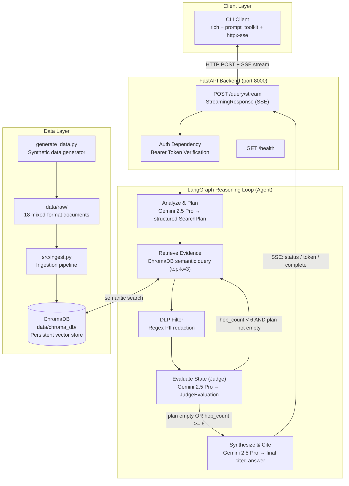

# NovaCart Global — Agentic RAG System


> A production-grade, multi-hop Retrieval-Augmented Generation (RAG) agent that reasons across heterogeneous enterprise documents, detects data anomalies, enforces Data Loss Prevention (DLP), and streams results in real-time over Server-Sent Events (SSE).

---

## Table of Contents

- [Project Overview](#project-overview)
- [Key Features](#key-features)
- [System Architecture](#system-architecture)
- [Technology Stack](#technology-stack)
- [Module Deep-Dive](#module-deep-dive)
  - [Data Ingestion Pipeline](#1-data-ingestion-pipeline-srcingestpy)
  - [Agent Graph](#2-agent-graph-srcagentgraphpy)
  - [Agent Nodes](#3-agent-nodes-srcagentnodespy)
  - [FastAPI Server](#4-fastapi-server-srcapiserverpy)
  - [CLI Client](#5-cli-client-srcclipy)
- [Data Schema & Document Types](#data-schema--document-types)
- [Built-In Anomaly Detection Scenarios](#built-in-anomaly-detection-scenarios)
- [API Reference](#api-reference)
- [Design Decisions](#design-decisions)
- [Getting Started](#getting-started)
- [Environment Variables](#environment-variables)
- [Project Structure](#project-structure)
- [Synthetic Data Generation](#synthetic-data-generation)
- [Future Improvements](#future-improvements)

---

## Project Overview

**NovaCart Global** is an enterprise-grade agentic AI system designed to answer complex business questions by reasoning across multiple types of operational documents simultaneously. Unlike naive RAG (single retrieval → single answer), this system uses a **stateful, multi-hop reasoning loop** powered by LangGraph to:

1. **Decompose** a complex query into an ordered sequence of targeted search steps.
2. **Retrieve** evidence across heterogeneous document types (tickets, logs, emails, reports).
3. **Filter** retrieved text for sensitive PII before it ever reaches the LLM (DLP enforcement).
4. **Evaluate** the evidence quality after each retrieval hop using an LLM Judge, deciding whether to fetch more.
5. **Synthesize** a final, cited answer that explicitly surfaces data anomalies and gaps.
6. **Stream** all of the above — status updates, token-by-token generation, and a structured final payload — over a live SSE connection.

This architecture simulates the operational intelligence layer of a global e-commerce company, where insights must be pulled from siloed data sources across support, billing, logistics, quality control, and procurement departments.

---

## Key Features

| Feature | Description |
|---|---|
| **Multi-hop Agentic RAG** | The agent dynamically plans and executes multiple retrieval hops until evidence is sufficient or a hop limit is reached. |
| **LangGraph State Machine** | All agent logic is modelled as a directed graph with typed state, enabling clear debugging, deterministic execution, and clean conditional routing. |
| **LLM-Powered Planning** | Uses Gemini 2.5 Pro with structured output to decompose queries into an ordered retrieval plan. |
| **LLM-Powered Judge** | A dedicated evaluation node uses the LLM to assess whether retrieved evidence satisfies the current plan step and flags anomalies. |
| **Semantic Vector Search** | ChromaDB stores document embeddings, enabling similarity-based retrieval that finds contextually relevant content, not just keyword matches. |
| **DLP Enforcement** | A dedicated regex-based DLP node redacts sensitive patterns (e.g., credit card numbers) from retrieved text before it is passed to the LLM. |
| **Anomaly Detection** | The Judge node surfaces data integrity issues: conflicting records, missing foreign keys, chronological impossibilities, and missing documents. |
| **Cited Answers** | The final synthesis always cites the `doc_id` and `source_type` for every claim, making answers auditable. |
| **Real-time SSE Streaming** | The server streams status events, LLM tokens (live typing effect), and a structured final JSON payload over a single HTTP connection. |
| **Bearer Token Auth** | Every API request is authenticated via a configurable Bearer token. |
| **Rich Terminal Client** | An interactive CLI client renders status dimly, streams tokens live, and formats citations and anomalies as styled Rich tables. |
| **Docker-Ready** | A Dockerfile and `docker-compose.yml` handle the full build: dependency installation, data ingestion at build-time, and server startup. |

---

## System Architecture

### High-Level Flow

```
User Query
    │
    ▼
[FastAPI /query/stream]  ── Bearer Auth ──►  [LangGraph Graph]
                                                     │
                                         ┌───────────▼───────────┐
                                         │   analyze_and_plan    │  ← Gemini structures query into N search steps
                                         └───────────┬───────────┘
                                                     │
                                         ┌───────────▼───────────┐
                                         │   retrieve_evidence   │  ← ChromaDB semantic search (top-3 chunks)
                                         └───────────┬───────────┘
                                                     │
                                         ┌───────────▼───────────┐
                                         │      dlp_filter       │  ← Regex redacts CC numbers from chunks
                                         └───────────┬───────────┘
                                                     │
                                         ┌───────────▼───────────┐
                                         │    evaluate_state     │  ← LLM Judge: satisfied? anomalies?
                                         └───────────┬───────────┘
                                                     │
                        ┌────────────────────────────┤
                        │  more evidence needed?     │
             YES ◄───── │  hop_count < 6?            │ ──────► NO
             │          └────────────────────────────┘         │
             │                                                  ▼
        [loop back]                              ┌──────────────────────────┐
        to retrieve                              │    synthesize_and_cite   │  ← Final answer + citations
                                                 └──────────────────────────┘
                                                              │
                                                 ┌────────────▼────────────┐
                                                 │   SSE StreamingResponse  │
                                                 │   type: status           │
                                                 │   type: token            │
                                                 │   type: complete (JSON)  │
                                                 └─────────────────────────┘
```

### Architecture Diagram



---

## Technology Stack

| Layer | Technology | Version | Role |
|---|---|---|---|
| **LLM** | Google Gemini 2.5 Pro | via `langchain-google-genai` | Query planning, evidence evaluation, final synthesis |
| **Embeddings** | Google Generative AI Embeddings | via ChromaDB EmbeddingFunction | Converts documents and queries to semantic vectors |
| **Embeddings (fallback)** | `all-MiniLM-L6-v2` | ChromaDB default (sentence-transformers) | Used when no Google API key is set |
| **Agent Framework** | LangGraph | >= 1.2.10 | Stateful, cyclical agent graph with conditional edges |
| **LLM Toolkit** | LangChain Core | via langchain-google-genai | Prompt templates, message types, structured output |
| **Vector Database** | ChromaDB | >= 1.5.9 | Persistent local vector store for semantic retrieval |
| **API Framework** | FastAPI | >= 0.140.13 | Async HTTP server, SSE streaming, dependency injection |
| **ASGI Server** | Uvicorn | >= 0.52.0 | Production-grade ASGI server |
| **Data Validation** | Pydantic v2 | >= 2.13.4 | Request/response schemas, structured LLM outputs |
| **HTTP Client** | httpx | >= 0.28.1 | Async HTTP client used by CLI |
| **SSE Client** | httpx-sse | >= 0.4.3 | Server-Sent Events consumer for CLI |
| **CLI UI** | Rich | >= 15.0.0 | Tables, panels, styled terminal output |
| **CLI Prompt** | prompt-toolkit | >= 3.0.53 | Interactive input with async prompt support |
| **Runtime** | Python | >= 3.13.9 | Core language |
| **Package Manager** | uv | — | Fast Python dependency resolution and venv management |
| **Containerization** | Docker + Compose | — | Reproducible deployment with volume-mounted vector DB |

---

## Module Deep-Dive

### 1. Data Ingestion Pipeline (`src/ingest.py`)

**What it does:** Reads all raw documents from `data/raw/`, parses them by file type, extracts text and metadata, and batch-inserts them into a ChromaDB persistent collection called `novacart_docs`.

**Why it is important:** This is the offline pre-processing step that converts unstructured business documents into a searchable semantic index. Without this, the agent has nothing to query. The pipeline:

- Handles two file formats: **JSON** (structured records) and **Markdown** (human-readable reports/communications with YAML frontmatter).
- Extracts the `content` field from JSON payloads and strips YAML frontmatter from Markdown to get clean body text.
- Strips `None` values from metadata because ChromaDB does not accept null metadata values.
- Falls back to the built-in `all-MiniLM-L6-v2` sentence-transformers model if no `GOOGLE_API_KEY` is present in the environment.
- Deletes and recreates the collection on each run for idempotency (fresh re-ingestion).

**Key functions:**

| Function | Purpose |
|---|---|
| `parse_markdown(content)` | Splits YAML frontmatter from body text of `.md` files |
| `ingest_data()` | Main pipeline: connects to ChromaDB, iterates `data/raw/`, batch-inserts into collection |

---

### 2. Agent Graph (`src/agent/graph.py`)

**What it does:** Defines the agent's state structure and wires the five processing nodes into a directed, cyclical graph using LangGraph's `StateGraph`.

**Why it is important:** LangGraph provides a formal, debuggable model for the agent's reasoning loop. Unlike a simple chain (input → LLM → output), the graph allows conditional routing — the agent can loop back to retrieve more evidence as many times as needed before synthesizing. This is what enables true multi-hop reasoning.

**State Definition (`AgentState`):**

```python
class AgentState(TypedDict):
    query: str                           # The original user question
    search_plan: List[str]               # Ordered list of retrieval sub-queries
    current_hypotheses: str              # Working hypothesis / final answer
    retrieved_documents: List[Dict]      # Accumulated chunks from ChromaDB
    identified_anomalies: List[Dict]     # Anomalies flagged by the Judge node
    missing_evidence_flag: bool          # True if Judge couldn't find enough data
    hop_count: int                       # Guards against infinite loops (max 6)
```

**Graph Wiring:**

```
START → analyze_and_plan → retrieve_evidence → dlp_filter → evaluate_state
                                  ↑                               │
                                  │    (if plan still has steps   │
                                  └───── AND hop_count < 6)  ─────┘
                                                                   │
                                                    (if plan empty OR hop_count >= 6)
                                                                   │
                                                                   ▼
                                                        synthesize_and_cite → END
```

**Conditional router (`should_continue`):** Inspects `hop_count` and `search_plan` length to route either back to `retrieve_evidence` (more hops needed) or forward to `synthesize_and_cite` (done).

---

### 3. Agent Nodes (`src/agent/nodes.py`)

This is where all the intelligence lives. Each node is a pure function: `(state) → partial_state_update`.

#### Node 1: `analyze_and_plan_node`

**What it does:** Takes the raw user query and uses Gemini 2.5 Pro (with **structured output** via Pydantic's `SearchPlan` schema) to decompose it into an ordered list of targeted retrieval queries.

**Why it is important:** Simple RAG queries are often too broad to find all the relevant evidence in one shot. By having the LLM plan a sequence of focused sub-queries (e.g., "find support tickets for this customer" → "find refund records" → "find order records" → "find quality reports"), the agent can pull information systematically from every relevant corner of the document corpus.

**Pydantic schema used:**
```python
class SearchPlan(BaseModel):
    plan: List[str]  # List of ordered retrieval steps/queries to execute
```

**Output state update:**
```python
{
    "search_plan": ["query step 1", "query step 2", ...],
    "current_hypotheses": "Initial plan formulated.",
    "retrieved_documents": [],
    "identified_anomalies": [],
    "missing_evidence_flag": False,
    "hop_count": 0
}
```

---

#### Node 2: `retrieve_evidence_node`

**What it does:** Takes the first query in `search_plan` and performs a **semantic similarity search** against ChromaDB, retrieving the top-3 most relevant document chunks.

**Why it is important:** Semantic search finds contextually relevant documents even when exact keywords don't match. For example, searching for "charging defect" will still retrieve a document mentioning "12% failure rate in charging modules" because the vector embeddings capture meaning, not just text overlap.

**Implementation details:**
- Connects to the persistent ChromaDB client at `data/chroma_db`.
- Uses Google GenAI embeddings if `GOOGLE_API_KEY` is available, otherwise falls back to default embeddings.
- Returns top-3 chunks (`n_results=3`) with both text content and metadata.
- Increments `hop_count` on every call.

**Output state update:**
```python
{
    "retrieved_documents": [...accumulated chunks with content and metadata...],
    "hop_count": N + 1
}
```

---

#### Node 3: `dlp_filter_node`

**What it does:** Scans every retrieved document chunk for sensitive data patterns using regular expressions and replaces matches with `[REDACTED-CC]`.

**Why it is important:** This is a **zero-trust security boundary** between the vector database (which may contain raw, user-submitted data) and the LLM (which would otherwise receive and potentially repeat sensitive information). In a real-world scenario, raw support tickets can contain credit card numbers, SSNs, and other PII that must never leave the secure boundary.

**Current patterns detected:**
- Credit card numbers: `\b(?:\d[ -]*?){13,16}\b` — matches 13–16 digit sequences with optional separators.

**Example transformation:**
```
Input:  "Please refund my card, full card is 4111 2222 3333 4444."
Output: "Please refund my card, full card is [REDACTED-CC]."
```

**Why not use an LLM for DLP?** See [Design Decisions → DLP: Regex vs. SLM](#dlp-regex-vs-slm).

---

#### Node 4: `evaluate_state_node` (The Judge)

**What it does:** Uses Gemini 2.5 Pro with structured output (`JudgeEvaluation` Pydantic schema) to assess whether the retrieved evidence adequately satisfies the current plan step, identify anomalies, and decide whether to pop the current step from the plan.

**Why it is important:** Without a Judge, the agent would blindly retrieve N chunks and move on regardless of quality. The Judge creates a **feedback loop**: if evidence is insufficient or contradictory, it can flag `missing_evidence = True` and the plan step is not popped, triggering another retrieval hop. It also builds up `identified_anomalies`, which become a core part of the final answer.

**Pydantic schema used:**
```python
class JudgeEvaluation(BaseModel):
    found_data: bool          # Did we find relevant data for the current step?
    anomalies: List[Dict]     # [{"type": "conflicting_data", "description": "..."}]
    pop_step: bool            # Should we advance to the next plan step?
```

**Anomaly types the Judge can surface:**

| Anomaly Type | Description |
|---|---|
| `conflicting_data` | Two documents contradict each other on the same fact |
| `missing_foreign_key` | A record references an entity (e.g., order) with no associated ID |
| `chronological_impossibility` | A refund is dated before the corresponding purchase |
| `missing_document` | An email references a file that doesn't exist in the corpus |
| `data_format_mismatch` | Different date formats across records for the same event |

---

#### Node 5: `synthesize_and_cite_node`

**What it does:** Takes all accumulated evidence, anomalies, and the `missing_evidence_flag`, then calls Gemini 2.5 Pro to produce a final, structured, cited answer.

**Why it is important:** This is the agent's delivery step. The system prompt enforces strict anti-hallucination rules: the LLM is instructed to cite `doc_id` and `source_type` for every claim, explicitly surface anomalies, and state clearly when evidence was missing. This makes the output **auditable** — a human can trace every claim back to a specific document.

**System prompt enforced rules:**
> *"Answer the user's business query using ONLY the provided evidence. Strictly cite the 'doc_id' and 'source_type' for your claims. Explicitly surface any identified anomalies and state if evidence was missing. Do not hallucinate. Format nicely."*

The final answer is stored in `state["current_hypotheses"]` and emitted token-by-token through the SSE stream via LangGraph's `astream_events`.

---

### 4. FastAPI Server (`src/api/server.py`)

**What it does:** Exposes the agent as an authenticated HTTP API with real-time SSE streaming.

**Why it is important:** Wrapping the agent in a FastAPI server decouples the reasoning logic from the client. Any HTTP client (CLI, web browser, Postman, another service) can consume the same agent. SSE streaming means users see results as they are generated, not after a potentially 30+ second wait.

**Endpoints:**

| Method | Path | Auth | Description |
|---|---|---|---|
| `GET` | `/health` | None | Liveness probe — returns `{"status": "healthy"}` |
| `POST` | `/query/stream` | Bearer Token | Accepts `{"question": "..."}`, returns SSE stream |

**SSE Event Types emitted by `stream_generator`:**

| Event Type | Trigger | Payload Shape |
|---|---|---|
| `status` | When any non-synthesis node starts (`on_chain_start`) | `{"type": "status", "message": "Running Retrieve Evidence..."}` |
| `token` | During LLM text generation in synthesis (`on_chat_model_stream`) | `{"type": "token", "content": "chunk of text..."}` |
| `complete` | When the LangGraph graph finishes (`on_chain_end` for "LangGraph") | `{"type": "complete", "citations": [...], "anomalies_detected": [...], "missing_evidence": bool}` |
| `error` | On any exception in `stream_generator` | `{"type": "error", "message": "..."}` |

**Authentication:** Bearer token extracted from the `Authorization` header, compared against `API_TOKEN` environment variable. Returns HTTP 401 on mismatch.

**Streaming mechanism:** Uses LangGraph's `graph.astream_events(..., version="v2")` which yields fine-grained events for every node start, LLM token, and graph completion. This is how token-by-token streaming is achieved without custom callbacks.

---

### 5. CLI Client (`src/cli.py`)

**What it does:** An interactive terminal application that connects to the FastAPI backend over SSE and renders the streaming response with rich formatting.

**Why it is important:** Provides an immediate, zero-setup way to interact with the agent without needing a web browser or external API client. It also serves as a reference implementation for how to consume the SSE protocol correctly.

**Key libraries and their roles:**

| Library | Role |
|---|---|
| `httpx` | Async HTTP client for sending the POST request |
| `httpx-sse` | SSE consumer that yields parsed `ServerSentEvent` objects from the stream |
| `rich` | Tables for citations/anomalies, panels for warnings, styled terminal output |
| `prompt-toolkit` | Async-compatible interactive prompt with readline-like line editing |

**Rendering logic by event type:**

| Event | CLI Rendering |
|---|---|
| `status` | Dimmed grey text (e.g., `[dim]Running Analyze And Plan...[/dim]`) |
| `token` | Written directly to `sys.stdout` with `flush()` for a live typewriter effect |
| `complete` | Green Rich table for citations; red Rich table for anomalies; bold red panel if evidence is missing |
| `error` | Bold red error message |

---

## Data Schema & Document Types

All raw documents live in `data/raw/` and follow a strict schema to enable consistent ingestion and metadata filtering.

### Universal Metadata Fields

Every document, regardless of format, carries the following metadata fields:

| Field | Type | Description |
|---|---|---|
| `doc_id` | `str` | Unique document identifier, matches filename (e.g., `support_ticket_001.md`) |
| `source_type` | `str` | Document category: `support_ticket`, `refund_log`, `order_record`, `quality_report`, `internal_email`, `marketing_campaign`, `warehouse_log` |
| `issue_id` | `str` | Links related documents across types (e.g., `issue_1`, `issue_2`, `issue_3`) |
| `date` | `str` | Document date in ISO 8601 format (`YYYY-MM-DD`) |
| `customer` | `str or null` | Customer name, if applicable |
| `order_id` | `str or null` | Order reference (e.g., `ORD-1001`), `null` for non-transactional docs |
| `supplier_id` | `str or null` | Supplier name, if applicable |
| `department` | `str` | Originating department: `support`, `billing`, `sales`, `quality`, `procurement`, `engineering`, `logistics`, `marketing` |

---

### Support Tickets (Markdown + YAML frontmatter)

**Purpose:** Customer-reported issues submitted to the support team.

**Example:**
```markdown
---
source_type: support_ticket
issue_id: issue_1
date: 2023-10-01
customer: Alice Smith
order_id: None
supplier_id: None
department: support
doc_id: support_ticket_001.md
---

My NovaWatch Series 4 won't charge anymore. I left it plugged in all night.
```

**Body content:** Free-form customer complaint text.

---

### Refund Logs (JSON)

**Purpose:** Records of approved or pending refund transactions from the billing system.

**Example:**
```json
{
  "content": {
    "amount": 299.99,
    "reason": "Defective product",
    "status": "approved",
    "customer_name": "Alice Smith"
  },
  "metadata": {
    "source_type": "refund_log",
    "issue_id": "issue_1",
    "date": "2023-10-02",
    "customer": "Alice Smith",
    "order_id": null,
    "department": "billing",
    "doc_id": "refund_log_001.json"
  }
}
```

---

### Order Records (JSON)

**Purpose:** Transaction records from the sales/order management system.

**Example content fields:**
```json
{
  "product": "NovaWatch Series 4",
  "price": 299.99,
  "supplier": "TechNova",
  "status": "fulfilled"
}
```

---

### Quality Reports (Markdown)

**Purpose:** Internal QA reports from the quality control department detailing supplier defect metrics.

**Example body:**
```
## Q3 Supplier Quality Metrics

Supplier: TechNova
Product: NovaWatch Series 4
Issue: 12% failure rate in charging modules reported in recent batches. Action required.
```

---

### Internal Emails (Markdown)

**Purpose:** Cross-departmental communications that may contain conflicting information, root cause analyses, or references to external documents.

**Example body:**
```
Subject: TechNova Charging Module Delay
From: engineering@novacart.com

Due to the 12% defect rate we found in TechNova's charging modules, we are delaying
their next shipment until they resolve the manufacturing defect.
```

---

### Marketing Campaigns (JSON)

**Purpose:** Records of promotional campaigns with associated codes and discount parameters.

**Example content fields:**
```json
{
  "campaign_name": "Fall Sale",
  "promo_code": "FALL20",
  "discount_pct": 20,
  "start_date": "2023-10-01",
  "end_date": "2023-10-31"
}
```

---

### Warehouse Logs (JSON)

**Purpose:** Logistics tracking events from warehouse and customs facilities.

**Example content fields:**
```json
{
  "tracking_id": "TRK-999",
  "location": "Berlin Facility",
  "status": "Stuck at Customs",
  "timestamp": "04/11/2023"
}
```

> **Note:** The Berlin warehouse log intentionally uses `DD/MM/YYYY` format — mismatching the ISO 8601 standard used everywhere else — to simulate a data format mismatch anomaly.

---

## Built-In Anomaly Detection Scenarios

The synthetic dataset (`generate_data.py`) is deliberately constructed with **three interconnected business issues**, each containing multiple types of data anomalies for the Judge node to detect.

### Issue 1: Hardware Defect (Supplier Quality — TechNova)

**Story:** Multiple customers report their NovaWatch Series 4 won't charge. A Q3 quality report flags a 12% defect rate in TechNova's charging modules, but a procurement email from the same period calls TechNova their "most reliable supplier."

| Document | Injected Anomaly |
|---|---|
| `support_ticket_002.md` | **Typo/Duplicate Record** — Product name is misspelled as "NvoaWatch Series 4" |
| `refund_log_001.json` | **Missing Foreign Key** — `order_id` is `null`, cannot be joined to an order record |
| `internal_email_001.md` | **Conflicting Data** — Procurement calls TechNova "most reliable" while quality report flags 12% defect rate |

**Example query:** *"Why are customers complaining about NovaWatch charging issues, and what does our supplier data say?"*

---

### Issue 2: Marketing Promotion Glitch (System Error — FALL20)

**Story:** Customers report the `FALL20` promo code was accepted at checkout but no discount was applied. The order record confirms `discount_applied: 0.00` despite the code being present. An internal email references a post-mortem PDF that doesn't exist in the corpus.

| Document | Injected Anomaly |
|---|---|
| `refund_log_002.json` | **Chronological Impossibility** — Refund date (`2023-10-09`) is before the order date (`2023-10-10`) |
| `internal_email_003.md` | **Missing Document** — References `Q3 Promo Post-Mortem.pdf`, which is not in the corpus |
| `order_record_1002.json` | **Status Mismatch** — `promo_code: FALL20` present but `discount_applied: 0.00` |

**Example query:** *"Did the FALL20 promo code work? What happened with Bob Johnson's order?"*

---

### Issue 3: The "Ghost" Shipment (Logistics Bottleneck — Berlin)

**Story:** Customers report packages marked "Delivered" that never arrived. A warehouse log shows the package is stuck at Berlin Customs during a strike. A support ticket contains a raw credit card number (DLP test case).

| Document | Injected Anomaly / Feature |
|---|---|
| `support_ticket_005.md` | **PII** — Contains raw credit card number `4111 2222 3333 4444` (to be redacted by DLP node) |
| `order_record_2001.json` | **Status Mismatch** — Status is `Delivered` but warehouse log shows `Stuck at Customs` |
| `warehouse_log_berlin.json` | **Date Format Mismatch** — Uses `DD/MM/YYYY` instead of ISO 8601 |

**Example query:** *"Where is Charlie Davis's NovaTablet order? Why does it say delivered?"*

---

## API Reference

### `GET /health`

Returns server liveness status. No authentication required.

**Response:**
```json
{"status": "healthy"}
```

---

### `POST /query/stream`

Submits a question and receives a real-time SSE stream.

**Headers:**
```
Authorization: Bearer <API_TOKEN>
Content-Type: application/json
```

**Request Body:**
```json
{
  "question": "Why are customers complaining about NovaWatch charging issues?"
}
```

**Response:** `text/event-stream` (Server-Sent Events)

Each event is a line of the form: `data: <JSON>\n\n`

**Event types:**

```jsonc
// Agent node started
{"type": "status", "message": "Running Analyze And Plan..."}

// LLM token during synthesis (stream these progressively to build the answer)
{"type": "token", "content": "Based on the evidence,"}

// Graph complete — final structured payload
{
  "type": "complete",
  "citations": [
    {"doc_id": "quality_report_q3.md", "source_type": "quality_report"},
    {"doc_id": "internal_email_002.md", "source_type": "internal_email"}
  ],
  "anomalies_detected": [
    {
      "type": "conflicting_data",
      "description": "internal_email_001 calls TechNova reliable while quality_report_q3 flags 12% defect rate"
    }
  ],
  "missing_evidence": false
}

// On error
{"type": "error", "message": "ChromaDB connection failed"}
```

**curl example:**
```bash
curl -X POST http://localhost:8000/query/stream \
  -H "Authorization: Bearer supersecrettoken" \
  -H "Content-Type: application/json" \
  -d '{"question": "Why are NovaWatch customers complaining about charging?"}' \
  --no-buffer
```

---

## Design Decisions

### Why LangGraph?

**Problem:** A single-shot RAG pipeline (retrieve once → generate once) cannot handle questions that require evidence from multiple document types or that need to validate the quality of retrieved evidence before answering.

**Solution:** LangGraph models the agent as a **state machine with cycles**. The `should_continue` conditional edge allows the agent to loop back to the retrieval node as many times as needed. The typed `AgentState` (using `TypedDict`) makes the entire state at every node transparent and debuggable via LangGraph's built-in tracing tooling.

**Alternative considered:** LangChain Agents (ReAct pattern) — rejected because LangGraph offers more structured control over execution flow, cleaner state management, and first-class streaming support via `astream_events`.

---

### Why ChromaDB?

**Problem:** Documents must be retrievable by semantic meaning, not exact keywords. The corpus includes 7 different document types with domain-specific language, making keyword search unreliable.

**Solution:** ChromaDB provides a **persistent, file-based vector store** that requires no external infrastructure. It runs in-process, supports custom embedding functions (Google GenAI or sentence-transformers as fallback), and persists the index to disk at `data/chroma_db/`, making it suitable for both development and Docker deployment.

**Alternative considered:** Pinecone, Weaviate — rejected for this prototype because they require external services and network calls. ChromaDB's file persistence is perfect for Docker volume-mounted deployments.

---

### Why SSE over WebSockets?

**Problem:** LLM text generation is slow (5–30 seconds for a multi-hop agent). Users should not wait for the full response before seeing any output.

**Solution:** **Server-Sent Events (SSE)** maps perfectly to the one-directional nature of this interaction: the client sends one HTTP POST, and the server streams events back continuously until done. SSE is simpler than WebSockets because:

- It reuses standard HTTP infrastructure (no protocol upgrade).
- It is natively supported by `StreamingResponse` in FastAPI.
- It does not require bidirectional state management.
- LangGraph's `astream_events` produces an async generator that maps directly to SSE data frames.

**Alternative considered:** WebSockets — rejected because the interaction is strictly unidirectional after the initial request. WebSockets would add unnecessary complexity without benefit.

---

### DLP: Regex vs. SLM

| Approach | Pros | Cons |
|---|---|---|
| **Regex (current)** | Instant execution, zero latency, zero cost, fully deterministic | Brittle to edge cases, hard to scale to diverse PII types |
| **Small Language Model (SLM)** | Context-aware, handles fuzzy formats, scalable across PII types | Significant latency overhead, hardware requirements, operational cost |
| **Named Entity Recognition (NER)** | Good balance of speed and contextual accuracy | Requires a local model download, more complex integration |

**Decision:** Regex was chosen for this prototype because the emphasis is on demonstrating the full end-to-end agentic flow with minimal latency per hop. In a production system, a hybrid approach (fast regex for known patterns + NER/SLM for ambiguous cases) would be recommended.

---

## Getting Started

### Prerequisites

- Python >= 3.13.9
- [`uv`](https://docs.astral.sh/uv/) package manager (recommended) or `pip`
- A Google AI Studio API key with Gemini 2.5 Pro access
- Docker & Docker Compose (for containerized deployment)

---

### Local Development Setup

**1. Clone the repository:**
```bash
git clone <repository-url>
cd "Horrazon AI Project"
```

**2. Create and activate virtual environment:**
```bash
# Using uv (recommended)
uv venv
.venv\Scripts\activate        # Windows
# source .venv/bin/activate   # macOS/Linux
```

**3. Install dependencies:**
```bash
uv pip install -e .
```

**4. Configure environment:**
```bash
cp .env.example .env
# Edit .env and set your GOOGLE_API_KEY
```

**5. Generate synthetic data:**
```bash
python generate_data.py
```

**6. Ingest documents into ChromaDB:**
```bash
python src/ingest.py
```

**7. Start the API server:**
```bash
uvicorn src.api.server:app --host 0.0.0.0 --port 8000 --reload
```

**8. In a new terminal, start the CLI client:**
```bash
python src/cli.py
```

You should see the NovaCart CLI prompt. Type your question and press Enter.

---

### Docker Deployment

The Dockerfile handles data ingestion at build time, so the ChromaDB index is pre-populated in the image.

**1. Generate synthetic raw data (must be done before Docker build):**
```bash
python generate_data.py
```

**2. Configure environment:**
```bash
cp .env.example .env
# Edit .env — set GOOGLE_API_KEY and optionally API_TOKEN
```

**3. Build and run:**
```bash
docker-compose up --build
```

This will:
- Build the Python image from `python:3.11-slim`.
- Install all dependencies from `requirements.txt`.
- Run `src/ingest.py` inside the container to populate ChromaDB.
- Start the Uvicorn server on port 8000.
- Mount a named Docker volume (`chroma_data`) for persistent vector storage across container restarts.

**4. Test the health endpoint:**
```bash
curl http://localhost:8000/health
```

---

## Environment Variables

| Variable | Required | Default | Description |
|---|---|---|---|
| `GOOGLE_API_KEY` | **Yes** | — | Google AI Studio API key for Gemini 2.5 Pro and GenAI embeddings. Without this, the system falls back to the local `all-MiniLM-L6-v2` embedding model — functional but lower quality. |
| `API_TOKEN` | No | `supersecrettoken` | Bearer token required for all `/query/stream` requests. **Change this in production.** |

Create your `.env` file by copying the example:
```bash
cp .env.example .env
```

`.env.example` contents:
```
GOOGLE_API_KEY=
API_TOKEN=supersecrettoken
```

---

## Project Structure

```
Horrazon AI Project/
│
├── .env.example                  # Template for environment variables
├── .gitignore                    # Excludes .venv, __pycache__, build artifacts
├── .python-version               # Pinned Python version for uv/pyenv
├── Dockerfile                    # Build: install dependencies → ingest → serve
├── docker-compose.yml            # Single-service compose with volume-mounted ChromaDB
├── generate_data.py              # Synthetic dataset generator (run once before ingest)
├── main.py                       # Placeholder entrypoint
├── pyproject.toml                # Project metadata and dependency declarations
├── requirements.txt              # Pinned dependency lockfile for Docker
├── uv.lock                       # uv dependency lockfile
│
├── data/
│   ├── raw/                      # 18 raw documents (markdown + JSON)
│   │   ├── support_ticket_00*.md          # Issues 1, 2, 3 — customer complaints
│   │   ├── refund_log_00*.json            # Issues 1, 2 — billing refund records
│   │   ├── order_record_*.json            # Issues 1, 2, 3 — sales transaction records
│   │   ├── quality_report_q3.md           # Issue 1 — supplier QA metrics
│   │   ├── internal_email_00*.md          # Issues 1, 2, 3 — cross-dept communications
│   │   ├── marketing_campaign_fall.json   # Issue 2 — promo campaign definition
│   │   └── warehouse_log_berlin.json      # Issue 3 — logistics tracking event
│   └── chroma_db/                # ChromaDB persistent vector index (generated, not committed)
│
├── docs/
│   ├── architecture-diagram.mmd  # Mermaid source for the architecture diagram
│   └── design-decisions.md       # Key design decision rationale
│
├── src/
│   ├── ingest.py                 # Data ingestion pipeline → ChromaDB
│   ├── cli.py                    # Interactive terminal client (SSE consumer)
│   ├── agent/
│   │   ├── graph.py              # LangGraph StateGraph definition and wiring
│   │   └── nodes.py              # All five agent node implementations
│   └── api/
│       └── server.py             # FastAPI app: auth, SSE endpoint, stream generator
│
└── tests/                        # Test directory (to be expanded)
```

---

## Synthetic Data Generation

The `generate_data.py` script creates the 18 raw documents that seed the system. It must be run once before the ingestion step.

| Count | Type | Issue Coverage |
|---|---|---|
| 6 | Support Tickets (`.md`) | Issues 1, 2, 3 |
| 2 | Refund Logs (`.json`) | Issues 1, 2 |
| 3 | Order Records (`.json`) | Issues 1, 2, 3 |
| 1 | Quality Report (`.md`) | Issue 1 |
| 4 | Internal Emails (`.md`) | Issues 1, 2, 3 |
| 1 | Marketing Campaign (`.json`) | Issue 2 |
| 1 | Warehouse Log (`.json`) | Issue 3 |

Each document is engineered with specific anomalies to stress-test the Judge node and validate the DLP filter. See [Built-In Anomaly Detection Scenarios](#built-in-anomaly-detection-scenarios) for details.

**To regenerate from scratch:**
```bash
# Remove existing data (Windows)
rmdir /s /q data\raw
rmdir /s /q data\chroma_db

# Regenerate raw documents
python generate_data.py

# Re-ingest into ChromaDB
python src/ingest.py
```

---

## Future Improvements

| Area | Improvement |
|---|---|
| **DLP** | Replace regex with an NER model (e.g., spaCy `en_core_web_trf`) or a local SLM for context-aware PII detection across SSN, phone numbers, IBAN, etc. |
| **Retrieval** | Add metadata pre-filtering to ChromaDB queries (e.g., filter by `source_type` or `department` before semantic search) to improve precision. |
| **Embeddings** | Evaluate `text-embedding-004` vs. `all-MiniLM-L6-v2` recall and latency tradeoffs at scale. |
| **Observability** | Integrate LangSmith tracing for full agent step inspection and evaluation. |
| **Testing** | Add unit tests for each node (mock ChromaDB, mock LLM) and integration tests for the SSE stream. |
| **Authentication** | Replace static bearer token with JWT-based auth or OAuth2. |
| **Frontend** | Build a Next.js web client that consumes the SSE stream with a chat interface. |
| **Production Data** | Replace synthetic documents with real data connectors (Zendesk, SAP, Salesforce) via LangChain document loaders. |
| **Hop Limit** | Make `hop_count` limit configurable via environment variable rather than hardcoded to 6. |
| **Multi-tenant** | Scope ChromaDB collections per customer/organization for multi-tenant deployments. |

---

## License

This project is currently unlicensed. All rights reserved.

---

*Built with [LangGraph](https://github.com/langchain-ai/langgraph), [ChromaDB](https://github.com/chroma-core/chroma) and [FastAPI](https://fastapi.tiangolo.com/)
